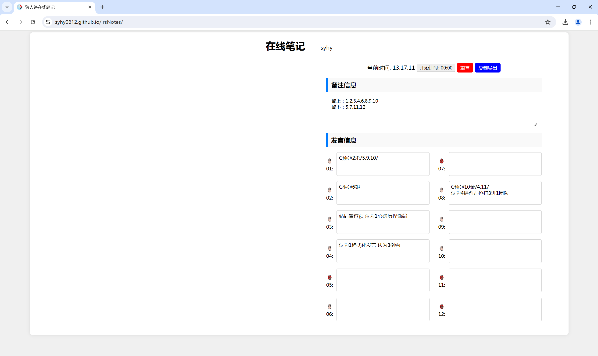
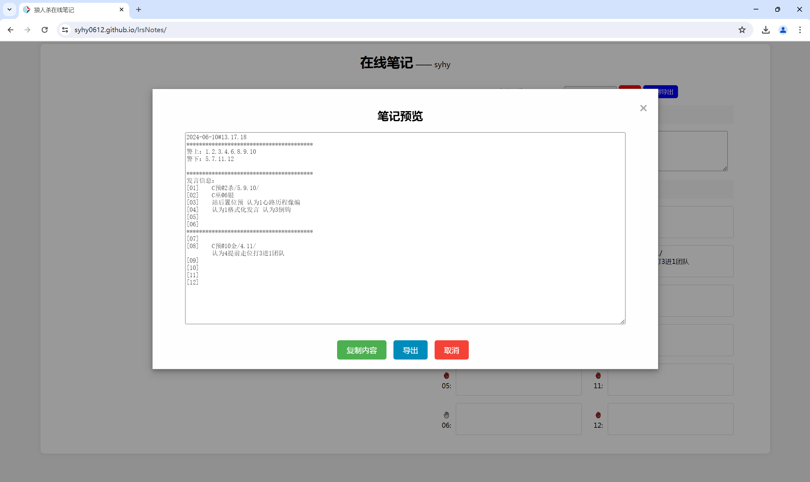

# 狼人杀在线笔记

狼人杀在线笔记是一个为狼人杀游戏玩家设计的工具，方便玩家记录发言信息并导出，提高游戏体验。

**项目地址**：[点击访问](https://syhy0612.github.io/lrsNotes/) 。

## 主要功能

- **实时时间显示和计时器**：显示当前时间，并提供一个计时器帮助记录游戏的时长。（20分钟内无效局）
- **笔记记录**：玩家可以记录每个玩家的发言信息。
- **图标切换**：通过点击举手图标来标记玩家的是否上警状态。
- **数据导出**：支持将笔记复制并导出为文本文件，方便保存和分享。
- **响应式布局**：适配不同大小的屏幕，优化移动设备和桌面设备的视觉体验。

## 目前可优化点

- **样式简陋**：如计时器，以后再优化。（开摆，反正没人看qaq）
- **加载较慢**：主要体现在点击举手图标切换时，要过会儿，js文件才加载完成，以后优化。
- **翻页功能**：允许用户在开始下一局不用重置当前笔记信息。
- **左侧空白**：电脑端访问时，左侧暂未设计功能界面，目前想法在Issues里有写。

## 项目截图

## 想说的话

2024-6-13小记  
其实也就是一时兴起，用手机自带的笔记记发言，想着为什么不自己写一个网页端，以方便记录发言警徽流信息呢。  
想着有gpt，虽然前端纯小白，但是写个记录笔记信息，应该不难吧，且自己还有一点点ps能力，图标什么自己也能搞定。  
但是当一直添加功能时，看着对自己来说陌生的js代码，全靠ai去写，自己都不太清楚哪里该改哪里该写，甚至可能用的都是过时的技术。  
突然就一种想法在脑袋里冒出，这样写出的项目，真的是自己的吗？  
于是，想了下，还是自己先把前端基本框架学着写一下。  
今天一个下拉框里增加版型信息，不会写，交给gpt，可能确实表述起来有点复杂，gpt也总是写不对。  
就算我这几天愣是逮着gpt4把功能大致实现了，但是自己的项目，自己的代码都看不懂，实在过于讽刺。
于是，这个项目暂时停更了，应该不会太久，半个月应该就够了，到时候再来完善这边的功能实现。
简单记一下目前需求功能吧：  
1.根据星期几去查询可勾选模糊查询版型进行选择，选择后，就可以选择需要的版型进行标记身份牌了，同时导出时信息也可加上版型信息。  
2.计时器等样式优化，现在真的好丑，图标也可以换一个狼人杀有关的图标，标记身份可以来点动态向弹出选择身份的样式好看点。  
3.那个锁的图并没有加实际功能，因为目前是暂时停止更新代码就搁置，所以把锁功能完善好，锁当时是锁定设置的警上警下玩家信息，并填入到备注信息里。
现在看来，应该可以只改成下面为锁定图标，a状态更改警上警下信息，b状态无法更改警上警下状态（还不是锁），上面到时候再说。  
4.增加缓存功能，或者有条件，可以增加页面功能，这把结束了，未必要重置，点击下一局就能记录下一局信息，都能存在浏览器缓存里。（为app做基础）  
5.增加设置功能，大概会替代目前的“说明”，设置里可以设置是否显示计时器功能，对了，计时器点击停止也要继续计时啊，又没确定（必须严谨一波）  
6.当时用gpt写的，所以那个号码代码里是1.7.2.8这样的顺序，虽然游戏里有逆序发言，所以也不用tab那边方便输入，但是如果8人10人玩又不好记录了，
怎么说呢，虽然是专职给网页狼人杀12人场写的，所以还是要把结构调正，方便以后如果说，我是说如果说以后确实写得还行过得去，有小伙伴拉分支，也能方便加自己非12人版型记录呢对吧。你看，我连画图的psd和字体都放进文件夹diy里了，如果想自己画新版型，甚至完全可以改字画就行了，不难的。  

最后就是，如果有小伙伴看到这个项目了，有想加功能的地方，也可以提一下议题让我知道这项目不是私人项目hhh，见面关系啊位置学之类暂时不会加，一个页面就做好一个主要功能就行，如果以后做了，放进友情链接就行。

## 引用说明

部分图标素材取自阿里巴巴矢量图标库 [https://www.iconfont.cn/]
